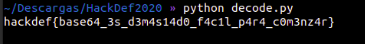

Para este reto se nos daba una dirección ip con su respectivo
puerto de conexión.

Se nos daba una archivo base64.py con el codigo fuente del servicio que
se encontraba corriendo el direccion ip

Los pasos a seguir para la optencion de la flag son sencillos

1. crear un socket, conectarse y recivir la flag en base64
2. corregir el metodo de decode en el codigo fuente

si se observada el codigo fuente del servicio se econtraba una funcion encode
la cual pasaba la cadena por otra funcion llamada "magic" pero cuando mandaban 
hacer el decode no se ocupaba saltandose un paso

"decode.py"
import base64
def magic(cryptic):
    return ''.join(c.lower() if c.isupper() else c.upper() if c.islower() else c for c in cryptic)
flag = "AgfJA2rLzNTIyxnLnJrFm3nFzdnTnhmXngqWx2y0yZfSx3a0CJrFyZbTm256nhj9cG=="
print(base64.b64decode(magic(flag))))

de esta forma usando la flag que nos daba el servicio y reescribiendo la funcion decode
sale la flag en "ascii"

